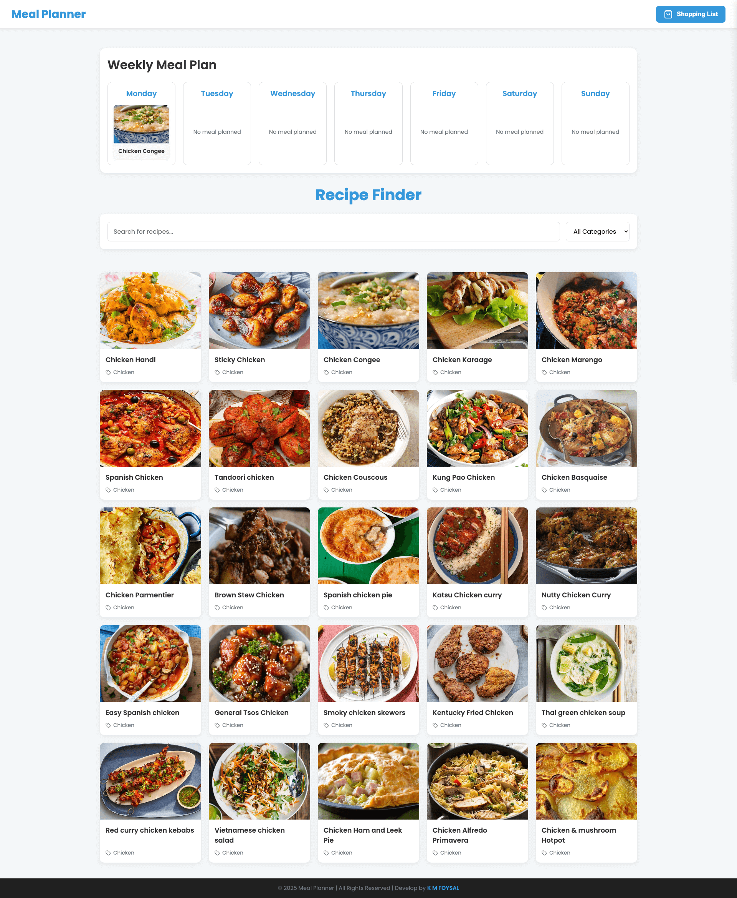
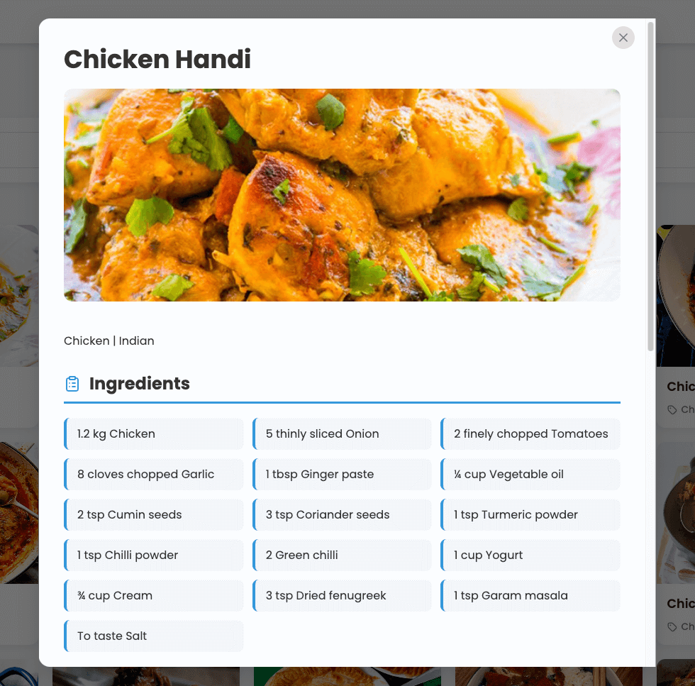
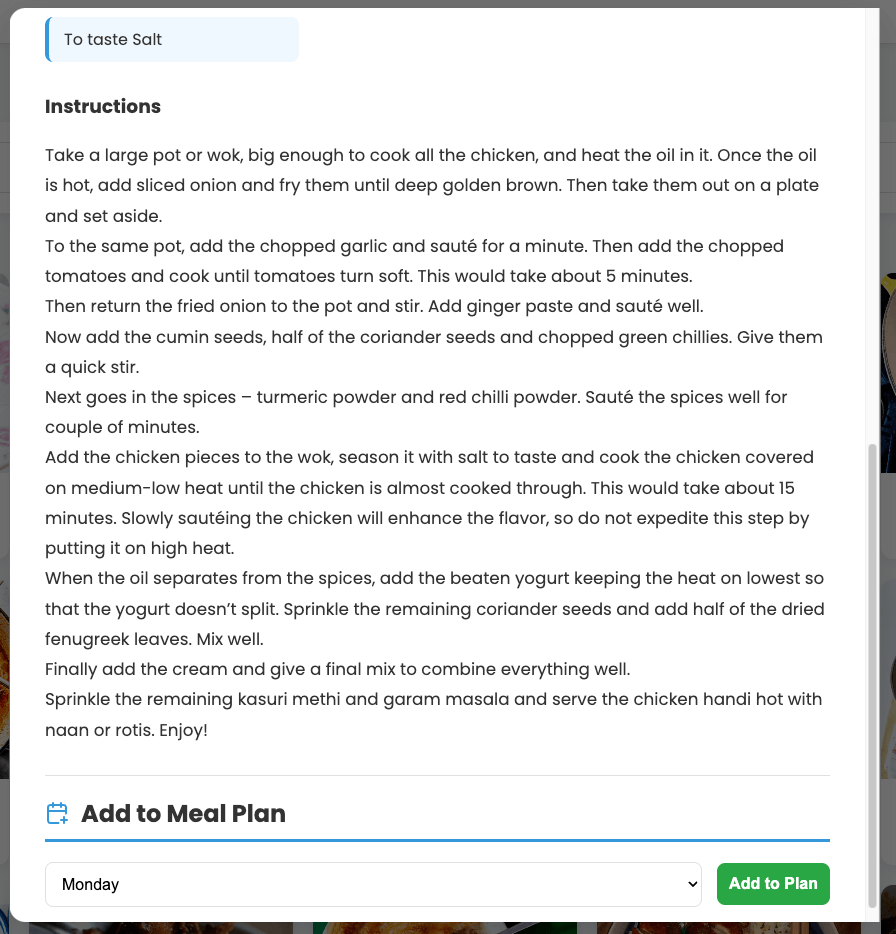
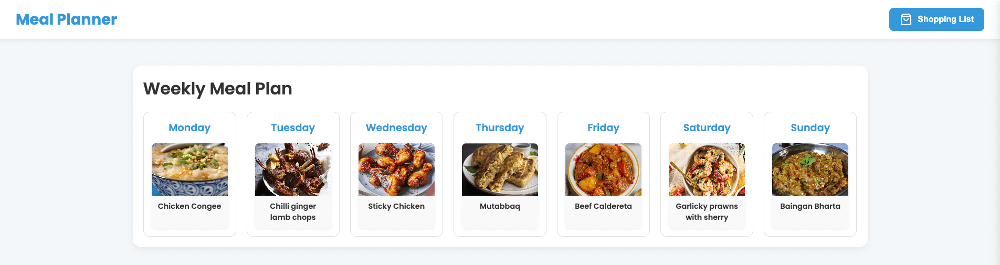
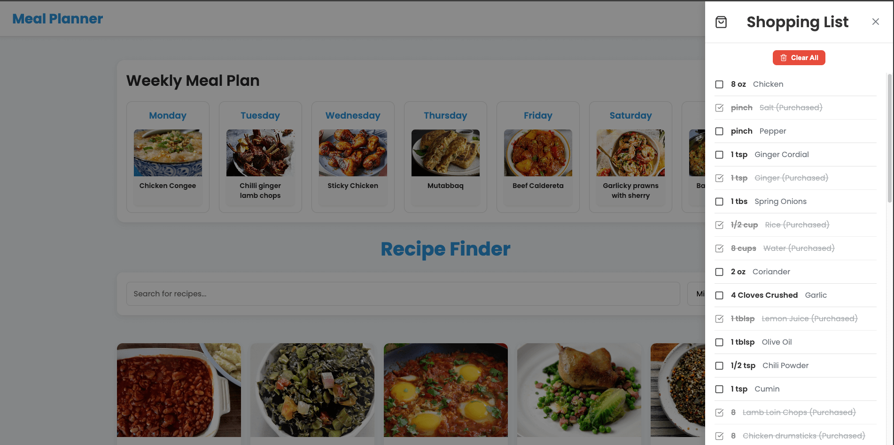
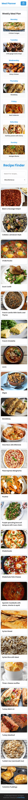

# Recipe Meal Planner

A modern web application built with React 19 and Vite that helps users plan their weekly meals, discover new recipes from TheMealDB API, and generate a comprehensive shopping list.

## 🎯 Features

-   **Recipe Search:** Search recipes by name and filter by category.
-   **Recipe Details:** View full details (ingredients, instructions, image) in an accessible modal.
-   **Weekly Meal Plan:** A 7-day calendar to add and remove recipes.
-   **Shopping List:** Auto-generated from planned meals, with checkboxes to mark items as purchased, presented in a toggleable sidebar.

## ✨ Key Technologies

-   **React 19:** Leveraging new features like the `use` hook and `useOptimistic`.
-   **Vite:** Fast development and build tool.
-   **Context API + useReducer:** For efficient state management.
-   **Lucide React:** For crisp, customizable SVG icons.
-   **TheMealDB API:** Free and comprehensive recipe data.
-   **Local Storage:** For meal plan persistence.
-   **CSS3:** For styling, animations, and responsive design.

## 🚀 Setup & Run

### Prerequisites

-   Node.js (LTS version recommended)
-   npm (Node Package Manager)

### Installation Steps

1.  **Clone the repository:**
    ```bash
    git clone [https://github.com/kmfoysal/recipe-meal-planner.git]
    cd recipe-meal-planner
    ```
2.  **Install dependencies:**
    ```bash
    npm install
    ```

### Environment Variables

This project uses TheMealDB API which is free and does not require an API key for the endpoints used. Therefore, no environment variables are needed for basic functionality.

### How to Run the Project

```bash
npm run dev
```
This will start the development server, usually accessible at `http://localhost:5173`.

## 🏛️ Architecture Overview

The application follows a component-based architecture typical for React applications, promoting reusability and separation of concerns.

### Folder Structure

```
src/
├── api/             # API client for TheMealDB interactions
├── components/      # Reusable UI components (RecipeCard, RecipeSearch, etc.)
│   └── layout/      # Layout-specific components (Header, Footer, Layout, ShoppingListSidebar)
├── context/         # React Context for global state management (MealPlanContext)
├── hooks/           # Custom React Hooks for logic encapsulation (useRecipes, useMealPlan, etc.)
├── assets/          # (Optional) Static assets like images, fonts
├── utils/           # Utility functions (e.g., data formatting)
└── App.jsx          # Main application component
└── main.jsx         # Application entry point
```

### State Management Approach

The application utilizes a hybrid approach:
-   **Context API with `useReducer`:** For managing global state such as the `mealPlan`. This centralizes complex state logic (adding/removing meals) and allows easy access across the component tree without prop drilling.
-   **`useOptimistic` (React 19):** Integrated within `MealPlanContext` for immediate UI feedback on user actions (e.g., adding a meal), enhancing perceived performance. Updates are wrapped in `useTransition` for smooth non-blocking UI.
-   **`useState`:** For local component-specific state (e.g., search query in `RecipeSearch`, purchased status in `ShoppingListSidebar`).

### Custom Hooks Purpose and Implementation

The project heavily relies on custom hooks to encapsulate reusable logic and side effects:
-   ```jsx
    useRecipes(searchQuery, category)
    ```
    : Fetches and filters recipes from TheMealDB.
-   ```jsx
    useRecipeDetails(id)
    ```
    : Fetches detailed information for a specific recipe.
-   ```jsx
    useMealPlan()
    ```
    : Provides access to the global meal plan state and actions (add/remove meal).
-   ```jsx
    useCategories()
    ```
    : Fetches the list of meal categories.

These hooks leverage React 19's ```use``` hook for streamlined asynchronous data fetching directly within components, simplifying data flow and error handling.

### Why specific libraries/patterns were chosen

-   **React 19 with Vite:** Chosen for its modern capabilities, fast refresh in development, and efficient bundling. React 19's new features (like the `use` hook for data fetching and `useOptimistic` for UI updates) were specifically embraced for a cutting-edge implementation.
-   **TheMealDB API:** Selected for its comprehensive free access, eliminating the need for complex API key management and providing a rich dataset of recipes.
-   **Lucide React:** A lightweight and highly customizable SVG icon library that seamlessly integrates with React, providing vector icons with minimal bundle size.
-   **Context API + useReducer:** This pattern was chosen for global state management due to its native React support, reducing the need for external state management libraries for this project's scope, while still offering robust state logic with reducers. The integration of `useOptimistic` enhances the perceived performance of state updates.
-   **`Promise.all()` for Shopping List:** Essential for efficient data fetching. When generating the shopping list, multiple recipe details need to be fetched. `Promise.all()` ensures these requests are made concurrently, minimizing load times.
-   **Simple CSS Animations:** Opted for native CSS animations and transitions over external JavaScript animation libraries (like Framer Motion) to keep the bundle size small, ensure high performance, and leverage browser-native animation capabilities.

### Trade-offs Made

-   **JavaScript over TypeScript:** While TypeScript was encouraged, the project was primarily developed in JavaScript to maintain a faster development pace and avoid initial setup complexities. Type-checking could be a future enhancement.
-   **Manual CSS for Animations:** Choosing CSS animations over a library like Framer Motion meant more manual implementation for complex effects, but resulted in a lighter-weight application.
-   **Basic Accessibility Features:** Implemented essential ARIA attributes and focus management manually. For extremely complex interactive components, a dedicated accessibility library might offer more robust, out-of-the-box solutions, but would add to the dependency footprint.

### What would be improved with more time

-   **Comprehensive Error Handling:** Implement a more sophisticated error handling strategy with dedicated error pages or more granular error states for API calls.
-   **Loading Skeletons:** Expand the use of loading skeletons to all asynchronous content loading areas for a smoother user experience, rather than just basic spinners.
-   **Advanced Offline Support (PWA):** Implement Service Workers for offline access and improved performance.
-   **Unit and Integration Testing:** Add a comprehensive suite of tests to ensure reliability and prevent regressions.
-   **Search Optimization:** Implement fuzzy searching or more advanced search algorithms.
-   **User Preferences/Settings:** Allow users to customize aspects of the app (e.g., theme, default meal plan days).

## ⏱️ Time Breakdown

| Task                      | Time Spent |
| :------------------------ | :--------- |
| Setup & Structure         | 1 hours    |
| Custom Hooks              | 3.5 hours  |
| State Management          | 2 hours    |
| UI Components             | 5 hours    |
| API Integration           | 2 hours    |
| UI/UX Enhancements (Icons, Animations, Layout) | 3 hours  |
| Accessibility Fixes       | 1.5 hours  |
| Bug Fixes & Refinements    | 3 hours    |
| Documentation             | 2 hours    |
| **Total**                 |**23 hours**|

## 🚧 Challenges Faced

1.  **`useOptimistic` & `useTransition` Integration:** Correctly integrating React 19's `useOptimistic` with `useTransition` was challenging. Initial implementations led to warnings about optimistic updates outside transitions, necessitating a deeper understanding of React's concurrent features and careful refactoring of state update logic in `MealPlanContext`.
2.  **Shopping List Data Flow & Caching:** Ensuring the Shopping List dynamically updated with the `mealPlan` and correctly fetched fresh recipe details (bypassing caching where necessary) required careful architectural adjustments in both the API client and the `ShoppingListSidebar` component.
3.  **Accessibility for Custom Components:** Implementing robust accessibility for custom interactive components (like the sidebar toggle button, modal focus trapping, and custom-styled checkboxes) required meticulous attention to ARIA attributes, keyboard navigation, and semantic HTML structure.

## 📸 Screenshots












